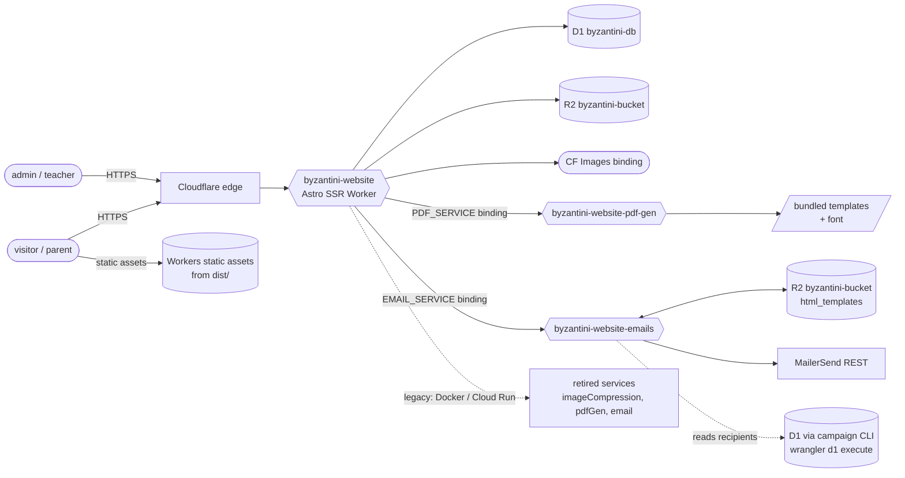
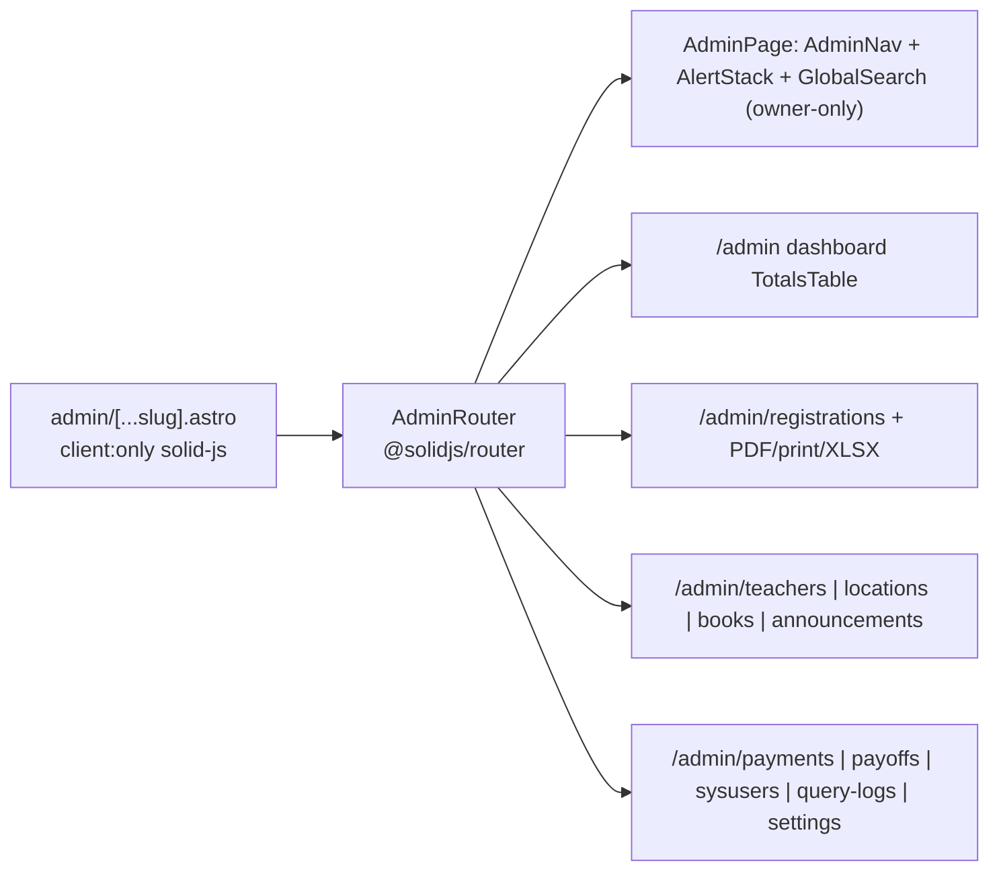
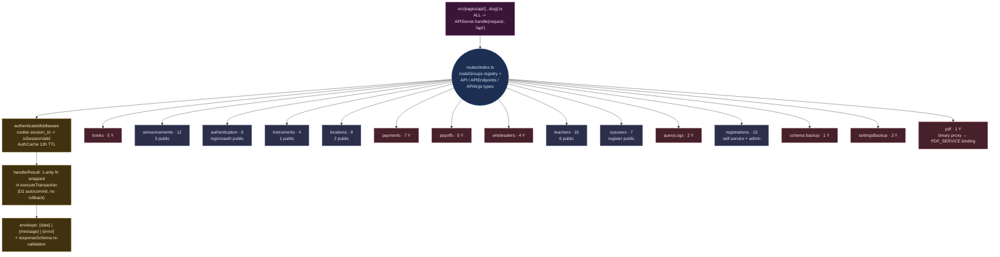
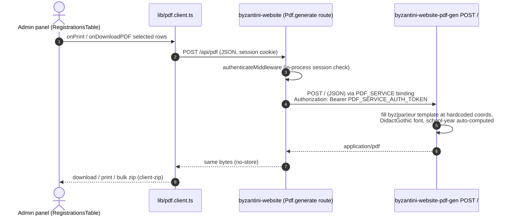

# Byzantini-Website — Codebase & Architecture Map

> Live interactive version: open **`visualize.html`** (same folder) in a browser — all diagrams rendered
> client-side with Mermaid 11, each with a “toggle source” / “copy” button.
>
> Snapshot surveyed on the `Workers` branch, generated from a full read-only sweep of the repo (pages, API
> layer, DB schema, storage, both aux workers, tooling). English annotations; user-facing UI text is Greek.

---

## 1 · What this is (TL;DR)

- **Public website + admin panel** (Greek UI) for the Byzantine music school of Metamorfosi:
  Astro 7 SSR + SolidJS islands + Tailwind 4, deployed as the Cloudflare Worker **`byzantini-website`**
  (static assets via the `@astrojs/cloudflare` adapter).
- **One typed internal API**: 15 route groups / **94 route instances** behind a single catch-all
  (`src/pages/api/[...slug].ts` → `APIServer.handle`). Zod contracts live on the route instances.
- **Data**: Cloudflare **D1** (one migration, 21 tables), **R2** behind the `Bucket` abstraction,
  **Cloudflare Images** for announcement thumbnails.
- **Two aux Cloudflare Workers** live in `services/` — but each in its **own separate git repo**
  (`Byz-PdfWorker`, `Automated-Mails-Byz`); both are gitignored by the main repo.
  - `byzantini-website-pdf-gen` (`services/pdfWorker`) — fills blank registration-form PDFs (admin only).
  - `byzantini-website-emails` (`services/emailWorker`) — transactional email + template publishing + campaign CLI.
- **Worker↔worker calls use service bindings** (`EMAIL_SERVICE`, `PDF_SERVICE` in the site
  `wrangler.jsonc` — no HTTP anywhere between workers); the only shared
  resource is the **same R2 bucket** (`byzantini-bucket`, site binding `S3_BUCKET`, email-worker binding `BUCKET`).
  The only remaining cross-service HTTP is CLI→worker (`templates:build` → `POST /html-templates`).
- Migration from a Docker/Cloud Run + Turso legacy is documented in `MIGRATION_PLAN.md` + `docs/` (phases 1–8
  mostly done; Phase 7 custom-domain cutover still pending).

## 2 · System context



Key transport facts (grep-verified):

| From | To | How |
| --- | --- | --- |
| Browser (admin) → site API | `POST /api/pdf` (`Pdf.generate`, session cookie) | same-origin fetch (`lib/pdf.client.ts`) — no worker URL in the browser |
| Site (API) → PDF worker | `PDF_SERVICE` service binding + `Authorization: Bearer <PDF_SERVICE_AUTH_TOKEN>` | `lib/api/routes/pdf.ts` proxy route |
| Site (API) → email worker | `EMAIL_SERVICE` service binding, `authToken` in JSON body | `lib/api/routes/emailService.ts` (only 2 triggers) |
| PDF worker → site | — | retired: no referer checks, no session back-call |
| Email worker → R2 | `BUCKET` binding: per-send reads + `POST /html-templates` publish | same bucket the site serves |
| CLI (`templates:build`) → email worker | `EMAIL_WORKER_URL` + authToken (dev machine) | HTTP `POST /html-templates` — cannot be a binding |
| Campaign CLI → D1 | `wrangler d1 execute --remote` (spawned per query) | uses `wrangler login` |

## 3 · Repo layout

```
AGENTS.md / CLAUDE.md→AGENTS.md   canonical AI-dev instructions (Greek project, Bun, no npm)
astro.config.mjs                  cloudflare adapter, solidJs(), sitemap (site=musicschool-metamorfosi.gr)
wrangler.jsonc                    worker byzantini-website: DB/S3_BUCKET/IMAGES/ASSETS + envs production|preview
src/                              100 files — pages, components, layouts, styles
  pages/                           index, sxoli/*, kathigites, spoudastiria, epikoinonia, eggrafes,
                                   login, admin/[...slug] (SPA), subscriptions, unsubscribe, oauth2callback,
                                   api/[...slug].ts, [...slug].ts (R2 CDN), 3 sitemap endpoints, 404
  components/                      admin/ (SPA tables), mainpage/, input/, other/, sxoli/, registrations/,
                                   headers/Links.astro, Navbar.astro, seo/, table/
  layouts/                         Layout, MainPageLayout, SigninLayout, AdminLayout
  styles/global.css                Tailwind 4 + dark-mode custom variant + theme tokens
lib/                              59 files
  api/routes/*.ts                  14 route groups + APIServer.ts + index.ts registry + middleware/authenticate.ts
  api/schemas.ts                   all Zod schemas (Greek messages)
  db.ts / utils.server.ts          D1 access + executeQuery/executeTransaction wrappers (query_logs audit)
  bucket/index.ts                  Bucket abstraction (R2 in prod, HTTP store in dev)
  images.ts                        in-process CF Images thumbnails
  pdf.client.ts                    browser-side PDF worker client
  env/                             runtime.ts bridge, env.ts merged Env, ownerEmail.ts
  hooks/                           useAPI.astro (in-process), useAPI.solid, apiCall, createAPIResource,
                                   useAPIClient, useCacheMutations, useSelectedRows
  routes/index.client.ts           stable client re-export of the API maps/types
  utilities/                       cookies, authentication (AuthCache), theme, classYears, random
migrations/0001_initial_schema.sql single migration — 21 tables
services/                          aux workers (SEPARATE git repos, ignored by main repo)
  pdfWorker/  byzantini-website-pdf-gen   emailWorker/  byzantini-website-emails
email/                             STALE duplicate of the emailWorker stack (gitignored; safe to delete)
tests/                             tests/api/*.test.ts (10 files) + testHelpers.ts
scripts/                           bucketServer, cf, replicate, googleReviews, exportTurso (leftover)
public/                            fonts, fa (Font Awesome), images, robots.txt, llms.txt
docs/ + MIGRATION_PLAN.md          migration specs + phase plans
types/                             entities, env, helpers (TS6-safe IsAny), global, custom-events
```

## 4 · Frontend

### 4.1 Pages

| URL | Type | Purpose |
| --- | --- | --- |
| `/` | prerendered SSR + client fetch | Home: hero, depts, stats, testimonials (real Google reviews), events/choir, top-3 announcements |
| `/eggrafes` | **Solid island** `RegistrationForm` | Public student registration / re-registration |
| `/sxoli/anakoinoseis`, `/sxoli/anakoinoseis/[slug]` | SSR (+vanilla script) | Announcement list + detail (views++, gallery/YouTube) |
| `/sxoli/xorodia`, `/sxoli/dioikitiko-symvoulio` | SSR | Choir + board pages (static) |
| `/kathigites` | SSR + vanilla tabs | Teachers by department (byz/par/eur) |
| `/spoudastiria`, `/epikoinonia` | SSR | Venues catalog · contact/FAQ/map |
| `/login`, `/admin/logout`, `/admin/signup/[link]` | SSR + vanilla scripts | Admin auth flows |
| `/admin/*` | **Solid island** `AdminRouter` (client:only) | Whole admin SPA (11 routes, see §4.3) |
| `/subscriptions`, `/unsubscribe/[...slug]` | SSR | Newsletter subscribe / unsubscribe |
| `/oauth2callback` | SSR shell + fetch | Google OAuth landing |
| `/api/[...slug].ts` | endpoint | The single API entry (`APIServer.handle`) |
| `[...slug].ts` | endpoint | R2 file CDN (announcement images, templates…); rewrites to `/404` |
| sitemap-index / sitemap-0 / sitemap-announcements | endpoints | SEO XML (announcements from D1) |

Only **two `client:` hydration directives** exist repo-wide (`/eggrafes`, `/admin/*`) — every other
interactive page uses vanilla `<script>` + `fetch`/`useAPI`.

### 4.2 Public nav (Navbar.astro)

Αρχική · Η Σχολή μας ▾ (Διοικητικό Συμβούλιο, Ανακοινώσεις, Χορωδία) · Εγγραφές · Καθηγητές ·
Σπουδαστήρια · Επικοινωνία. CSS-only mobile burger; `data-astro-prefetch="hover"`. No public footer exists.

### 4.3 Admin SPA (one island, 11 routes)



Admin sidebar groups: Σχολή (Εγγραφές, Καθηγητές, Παραρτήματα, Βιβλία, Ανακοινώσεις), Οικονομικά
(Οφειλές Μαθητών, Οφειλές Σχολής), Σύστημα (Διαχειριστές, Καταγραφή Ερωτημάτων, Ρυθμίσεις, Έξοδος).
Data flow: `createAPIResource` caches per endpoint → tables mutate via `useAPIClient`/`apiCall` →
`useCacheMutations` re-hydrates lists after writes.

Layouts: `Layout.astro`/`MainPageLayout.astro` (public), `SigninLayout.astro` (auth-ish pages),
`AdminLayout.astro` (dark theme + client-side session guard `Authentication.authenticateSession` → `/login`).
Styling: Tailwind 4 (`global.css`) with class-based dark mode (`lib/utilities/theme.ts`, localStorage
`dashboard-theme`); fonts Anaktoria (registered) + Didact Gothic (Google Fonts; the local ttf is unused).

## 5 · API layer

### 5.1 Dispatch pipeline



Server-side pages call `useAPI("Group.key", …)` **in-process** (no self-fetch — CF error-1042 workaround);
browser islands call the same names over HTTP. Endpoint-level inventory (94 rows) is on the **Endpoints
table** tab of `visualize.html`; here are the group summaries and quirks:

### 5.2 Groups & callers (condensed)

| Group | # | Public (no auth) | Main consumers |
| --- | --- | --- | --- |
| Teachers | 16 | list/priority/fullnames/classes/locations/instruments reads | public pages, admin table, RegistrationForm |
| Registrations | 13 | post, re-registration URL, email subscribe/unsubscribe/token | public form, admin table, newsletter pages |
| Announcements | 12 | get, page list, by-title (view++) | news pages + admin table |
| Locations | 8 | get, byPriority | public pages + admin table |
| Books · Wholesalers | 5+4 | — | admin book tables |
| Payments · Payoffs | 7+5 | — | admin finance tables |
| SysUsers | 7 | register link validation/signup | admin signup + SysUsers table |
| Authentication | 6 | login, OAuth state/callback | login/logout/signup + AdminLayout guard |
| Instruments | 4 | get | form selects + admin |
| QueryLogs | 2 | — | owner-only query-log viewer |
| Schema · SettingsBackup | 1+3 | — | admin DB/bucket backup (SettingsPage) |
| PDF | 1 | — | binary proxy → `PDF_SERVICE` binding (no JSON envelope) | admin PDF print/download |

Caller mechanics worth knowing:

- `useAPI.astro.ts` is **dual-mode**: with an Astro `ctx` it dispatches in-process; without one (imported
  from client `<script>`s) it performs a real browser fetch. Client imports drag the whole route registry
  metadata into bundles — safe only because bindings load lazily via the runtimeEnv facade.
- Solid side: `useAPI.solid.ts` (form + store), `useAPIClient.solid.ts`, `apiCall.ts` (framework-free),
  `createAPIResource.solid.ts` (per-endpoint shared caches), `useCacheMutations.solid.ts`
  (post-mutation getById→list hydration), `useSelectedRows.solid.ts`.
- Only 2 `multipart`/`rawBlob` endpoints: `Announcements.postImage` (multipart + thumbnail) and
  Teachers/Locations `fileUpload` (rawBlob PUT).
- Unknown API paths return **302 → `/404`** (an HTML page from an API), which in-process callers convert to errors.

### 5.3 Auth & sessions

- Middleware = one file (`middleware/authenticate.ts`): cookie `session_id` → `sys_users` lookup, cached
  12 h in an in-memory `AuthCache`. No roles: authenticated is all-or-nothing; the **only owner gate**
  (`isOwnerEmail`) is `SysUsers.delete`. Sessions are columns on `sys_users` (no sessions table):
  hex(32) id, `session_exp_date = now + 7 d` — **written but never compared** (expiry is nominal).
- Login: sha256 password (legacy), or Google OAuth (arctic, PKCE) with a `/login` and an
  invite-link `/admin/signup/[link]` variant; `oauth2callback.astro` stores a 14-day client session cookie.

## 6 · Data model (D1)

```mermaid
erDiagram
  REGISTRATIONS { int id PK; varchar am; varchar email; int class_id; int teacher_id; int instrument_id; varchar registration_url; int pass }
  TEACHERS { int id PK; string fullname; varchar amka; int online }
  CLASS_TYPE { int id PK; string name }
  TEACHER_CLASSES { int teacher_id PK; int class_id PK; int priority; varchar registration_number }
  INSTRUMENTS { int id PK; string name; string type; int isInstrument }
  TEACHER_INSTRUMENTS { int teacher_id PK; int instrument_id PK }
  LOCATIONS { int id PK; string name; string municipality; int priority; int partner }
  TEACHER_LOCATIONS { int teacher_id PK; int location_id PK }
  BOOKS { int id PK; string title; int wholesaler_id; int wholesale_price; int price; int quantity; int sold }
  WHOLESALERS { int id PK; string name }
  SCHOOL_PAYOFFS { int id PK; int wholesaler_id; int amount }
  PAYMENTS { int id PK; string student_name; int book_id; int amount; int book_amount }
  ANNOUNCEMENTS { int id PK; string title; string content; int views }
  ANNOUNCEMENT_IMAGES { int id PK; int announcement_id; string name; int is_main }
  SYS_USERS { int id PK; string email; string password; string session_id; int session_exp_date }
  SYS_USER_REGISTER_LINKS { string link; int exp_date }
  EMAIL_SUBSCRIPTIONS { string email PK; string unsubscribe_token; int unrelated }
  TOTAL_PAYMENTS { int amount }
  TOTAL_REGISTRATIONS { int amount; int year }
  TOTAL_SCHOOL_PAYOFFS { int amount }
  QUERY_LOGS { string id PK; string query; string args; int date; int error }
  TEACHERS ||--o{ TEACHER_CLASSES : teaches
  CLASS_TYPE ||--o{ TEACHER_CLASSES : grouped
  TEACHERS ||--o{ TEACHER_LOCATIONS : in
  LOCATIONS ||--o{ TEACHER_LOCATIONS : hosts
  TEACHERS ||--o{ TEACHER_INSTRUMENTS : plays
  INSTRUMENTS ||--o{ TEACHER_INSTRUMENTS : used
  REGISTRATIONS }o--|| TEACHERS : teacher_id
  REGISTRATIONS }o--o| CLASS_TYPE : class_id
  REGISTRATIONS }o--o| INSTRUMENTS : instrument_id
  WHOLESALERS ||--o{ BOOKS : supplies
  BOOKS ||--o{ PAYMENTS : sold-as
  WHOLESALERS ||--o{ SCHOOL_PAYOFFS : paid-out
  ANNOUNCEMENTS ||--o{ ANNOUNCEMENT_IMAGES : has
```

Facts:

- One migration (`0001_initial_schema.sql`); **no FK constraints or extra indexes** — integrity is enforced
  in handlers; dev DB rebuilds from `dbSnapshots/dev-snapshot.sql` (`bun run db:reset`).
- Writes go through `executeQuery` / `executeTransaction` (`lib/utils.server.ts`) over `dbExec`
  (`lib/db.ts`): multi-value SQL via `???` placeholders; every non-SELECT statement is audited into
  `query_logs` (best-effort). D1 has no interactive transactions — the tx shim logs and executes immediately.
- `total_*` tables are **hand-maintained accumulators** (drift risk flagged in §9).
- Direct binding access audit: only `lib/db.ts`, `lib/bucket/index.ts`, `lib/images.ts` touch
  `DB`/`S3_BUCKET`/`IMAGES` (plus the admin `Schema.get` dump which uses `dbExec` directly, deliberately).

## 7 · Storage (Bucket / R2)

`Bucket` (`lib/bucket/index.ts`): prod → R2 binding; dev → local HTTP store (`bun run bucket:serve`,
port 4567 over `bucket/latest`, started with `bun run dev`). R2 key layout in dev mirror (`bucket/latest`):

```
anakoinoseis/images/<announcement_id>/<file>   (+ thumb_<file> via CF Images)
kathigites/picture|cv/<fullname>…              spoudastiria/ (venue images)
html_templates/<year>/…                        pdf_templates/ (legacy copies)
emails/files/                                  choir/ + root poster.jpg, sitemaps, mitropolitis.jpg
```

`scripts/replicate.ts` syncs prod R2 → `bucket/latest` and archives dated snapshots `bucket/YY-MM-DD/`;
`googleReviews.ts` collects Google reviews into `google-reviews/` (testimonials source on the home page).

## 8 · Aux services

### 8.1 PDF worker — `byzantini-website-pdf-gen` (services/pdfWorker)



- One endpoint (`POST /`), reached **only through the site's `PDF_SERVICE`
  binding**; auth = site session middleware + shared bearer token
  (`SERVICE_AUTH_TOKEN` secret, constant-time compare). Templates+font bundled
  via ASSETS binding (`assets/`). No referer allowlist, no `IS_DEV`, no
  session back-call, no CORS.
- Only registration-form PDFs (admin-initiated): single print/download or bulk
  `printBulk`/`downloadBulk` (6 concurrent, exp backoff, `Εγγραφές.zip`). **No certificates / public flows.**

### 8.2 Email worker — `byzantini-website-emails` (services/emailWorker)

Two endpoints:

- `POST /html-templates` — publish built templates (authToken, ≤200 files, ≤512 KB each) → R2
  `html_templates/` under the **same bucket the site reads**.
- `POST /` — transactional send: template read per-send from the worker's own
  `BUCKET` binding (`html_templates/<name>` — same keys it publishes; no HTTP),
  `{{ key }}` substitution, then MailerSend REST (`no-reply@musicschool-metamorfosi.gr`);
  `DRY_RUN=true` logs instead. The site calls it through the `EMAIL_SERVICE`
  service binding (token still in the body).

Transactional triggers (only two, grep-verified):

1. `Registrations.post` — success email **only in production**, template picked from 7
   `epitixis_eggrafi*.html` variants by class/year (map in `registrations.ts`).
2. `SysUsers.createRegisterLink` — admin invite (`sysuser_register_link.html`, 24 h link).

### 8.3 Campaigns & template pipeline (CLI side)

- Templates: React Email components (`render/`) → `templates:build` renders static HTML with
  `{{ }}` placeholders → `--prod|--dev` publishes via `POST /html-templates`; also mirrors into
  `bucket/latest/html_templates/` locally. **No S3/R2 credentials anywhere in the CLI.**
- Campaign CLI (`bun run campaign`): recipients from **D1 via spawned `wrangler d1 execute --remote`**
  (default preview DB; `--send` requires prod). Five campaigns:
  `renew-2026`(+`-fix` resend), `return-2026`, `google-review-2026`, `teachers-eggrafes-2026` —
  renewal/return reminders with poster attachment, review solicitation, teacher invitations.
  Runner: blacklist + dedupe, pace ~800–1000 ms, daily cap 900, resumable state in `campaign-state/`,
  dry-run previews in `out/`, optional `--testmail`.
- Root `email/` is the **stale pre-move duplicate** of this stack (older revisions, Docker artifacts,
  mail_log, suppression CSV). emailWorker's README says it can be deleted once verified.

## 9 · Dev environment & tooling

```mermaid
flowchart LR
  subgraph DEV["one terminal: bun run dev"]
    ASTRO["astro dev :4321"]:::dev
    BS["bucket:serve :4567 (bucket/latest)"]:::dev
  end
  PDFD["wrangler dev pdfWorker :8787"]:::aux
  EMAILD["wrangler dev emailWorker :8788<br/>DRY_RUN=true"]:::aux
  D1L["D1 local SQLite<br/>.wrangler/state/v3/d1"]:::dev
  ASTRO --> BS
  ASTRO --> D1L
  ASTRO -->|PDF_SERVICE binding<br/>(cross-command resolution)| PDFD
  ASTRO -->|EMAIL_SERVICE binding<br/>(cross-command resolution)| EMAILD
  classDef dev fill:#123f33,stroke:#2f7a63,color:#d9f4ec
  classDef aux fill:#40310f,stroke:#8a6a1f,color:#f8eccd
```

| Area | Commands (Bun only) |
| --- | --- |
| Core | `bun install` · `bun run dev` (:4321 + bucket) · `bun run build` · `bun run typecheck` / `astro-check` / `check` |
| DB | `bun run db:reset` (rebuild from snapshot) · `db:query` / `db:query:prod` · `db:logs` · `db:replicate` |
| Data sync | `bun run replicate:all|db|bucket` (prod R2/D1 → dev) · `google:reviews` |
| Tests | `bun run test` — needs dev server + bucket:serve + `tests/.env.test`; 10 files cover most groups (Auth used only by helper; queryLogs/settingsBackup untested) |
| Aux workers | inside each `services/*`: `wrangler dev|deploy --config wrangler.jsonc` (never `--bun`); emailWorker also `templates:build --prod|--dev`, `campaign`, `remove-suppressed` |

Deploy (manual, real credentials — never in routine work): `bun run build` → `wrangler deploy
--config dist/server/wrangler.json`. Named envs: `preview` → `byzantini-db-preview` +
`byzantini-bucket-dev`; `production` mirrors top-level `byzantini-db` + `byzantini-bucket`.
**No CI**: `.github/` holds only the copilot instructions mirror; the aux-worker repos deploy independently.

## 10 · Env / secrets map (names only — never values)

| Key | Where | Purpose |
| --- | --- | --- |
| `DB` `S3_BUCKET` `IMAGES` `ASSETS` | wrangler.jsonc bindings | D1 / R2 / CF Images / static assets (per env) |
| `EMAIL_SERVICE` `PDF_SERVICE` | wrangler.jsonc `services` (top + named envs) | service bindings → `byzantini-website-emails` / `byzantini-website-pdf-gen` |
| `AUTOMATED_EMAILS_SERVICE_AUTH_TOKEN` | `.env` (dev) / CF secret (prod) | shared token for the emails worker (body `authToken`; must match worker `SERVICE_AUTH_TOKEN`) |
| `PDF_SERVICE_AUTH_TOKEN` | `.env` (dev) / CF secret (prod) | shared token for the PDF worker (`Authorization: Bearer`; must match worker `SERVICE_AUTH_TOKEN`) |
| `OWNER_EMAIL` / `VITE_OWNER_EMAIL` | `.env(.production)` | owner gate (`lib/env/ownerEmail.ts`, hardcoded fallback) |
| `VITE_URL` | `.env` | origin (tests, oauth) |
| `SECRET`, `GOOGLE_CLIENT_ID/SECRET`, `GOOGLE_MAPS_KEY` | `.env` (dev) / CF secrets (prod) | password pepper · Google OAuth login · review collector |
| `TURSO_DB_URL` `TURSO_DB_TOKEN` | `.env` | legacy DB export (`scripts/exportTurso.ts`) — kept until the final cutover |
| `DEV_BUCKET_LOCATION` | `.env` | local bucket store root (bucketServer; `DEV_BUCKET_URL` falls back to `127.0.0.1:4567`) |
| `MAILERSEND_API_KEY`, `SERVICE_AUTH_TOKEN`, `DRY_RUN` | emailWorker `.dev.vars` / `.env.*` | sending, auth, dry-run |
| `SERVICE_AUTH_TOKEN` | pdfWorker `.dev.vars` / secret | shared token for PDF_SERVICE binding calls |
| `TEST_EMAIL` `TEST_PASSWORD` `VITE_URL` | `tests/.env.test` | API test suite login |

> The site's root `.dev.vars` was removed (2026-09): dev values live in `.env`
> (Bun/Vite auto-load it; `Env.env` merges `import.meta.env` + the runtime
> env), production runtime secrets are Cloudflare secrets. Dead keys removed:
> `CONTACT_INFO`, `SAFE_BACKUP_SNAPSHOT`, `BACKUP_SNAPSHOT_LOCATION`,
> `DEV_SNAPSHOT_LOCATION`, `LATEST_MIGRATION_FILE`, `FORCE_TEST`,
> `PROJECT_ABSOLUTE_PATH` (main-repo copy). Pure-wrangler services keep their
> own `.dev.vars` (wrangler dev reads secrets only from there).

## 11 · Observations & risk register

Architecture notes (not bugs):

1. **No role model** — middleware is auth-or-401; any admin session can hit `SettingsBackup` (full DB dump
   + bucket files) and every admin endpoint. Owner gating (`isOwnerEmail`) is only on `SysUsers.delete`,
   `QueryLogs`, and the UI-level `GlobalSearch` (client-side).
2. **Session expiry is nominal** — `session_exp_date` never checked server-side; login cookie defaults
   `httpOnly=false`, `SameSite=Strict`; oauth2callback additionally plants a 14-day client-set cookie.
3. **`Registrations.post` is public + side-effectful** (DB insert + subscription upsert + prod email);
   no rate limiting seen — the only site flow that can fire an email in production.
4. **`useAPI.astro` dual-mode + registry re-export into client bundles** — the full route registry/Zod
   schemas ride along in client bundles; safe only via lazy env loading.
5. **Admin guard is client-side** (AdminLayout script → `authenticateSession`), not server middleware on
   `/admin/*`.
6. Greek-title slug logic (commas stripped for Cloudflare) is hand-copied across list/detail/sitemap/home
   with “keep in sync” comments — drift-prone.

Dead / leftover (cleanup candidates, all verified):

- `email/` root duplicate of the email worker stack (incl. legacy Docker + mail_log + suppression CSV).
- `contacts/to_vcf.ts` broken (imports removed `createDbConnection`); `SelectedRowContext.solid.tsx`
  never imported; `public/fonts/DidactGothic-Regular.ttf` unreferenced (Google Fonts used);
  `scripts/exportTurso.ts` unwired one-off; `Schema.get` endpoint + `Announcements.imagesDeleteByName`
  (admittedly unimplemented) + `*` `getTotal` endpoints + `Registrations.getSubscriptionToken` have no
  real callers.
- **Duplicate send logic** in emailWorker (`src/index.ts` REST vs `src/mailersend.ts` npm-SDK — one for
  workerd, one for the CLI) and duplicated Greek school-year computation (pdfWorker vs campaign queries).
- Several read/delete routes accept **unvalidated JSON bodies** (no request schema): Books.getById/delete,
  Wholesalers.getById/delete, Locations.getById/delete, Teachers.fileRename.
- A few schemaless-but-responseSchema-validated routes rely on `handlerResult`'s 1-arity → transaction
  heuristic (implicit magic, no rollback on D1).
- `Bucket` methods take a vestigial `APIContext` that call sites fake with `as unknown as APIContext`.

Docs drift: README §“Worker services (local Docker — PDF only)” and older “Pages-style” wording predate
the workers migration; AGENTS.md is the up-to-date authority.

---

*Generated from a read-only survey — for exploration only; treat it as a map, not as a source of truth
that outranks code. Regenerate when the architecture moves.*
